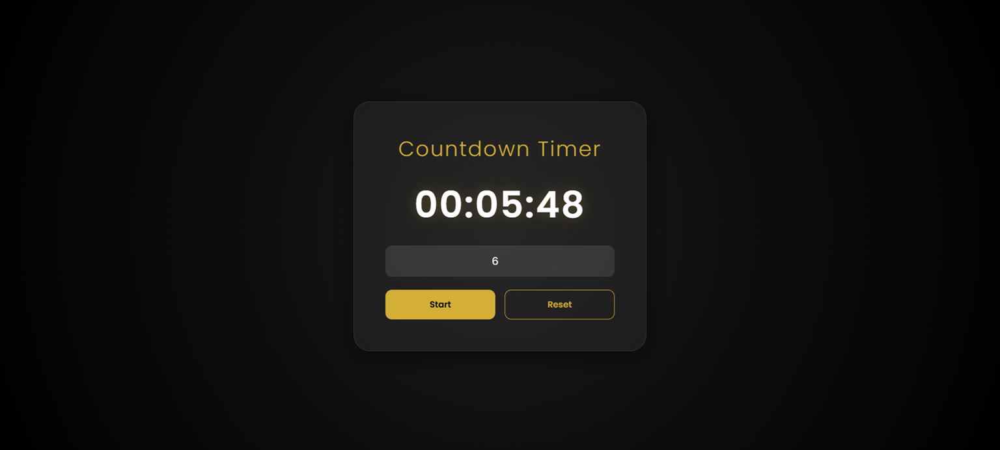

# Countdown Timer

A simple and functional countdown timer built with HTML, CSS, and Vanilla JavaScript.

## Features

- User-friendly input for setting the time in minutes.
- Real-time display of the remaining time.
- Start and Reset functionality for better control.
- Minimalist and clean user interface.

## Technologies Used

- HTML5
- CSS3
- JavaScript (DOM Manipulation, setInterval)

## How to Run

Simply open `index.html` in any modern web browser.
